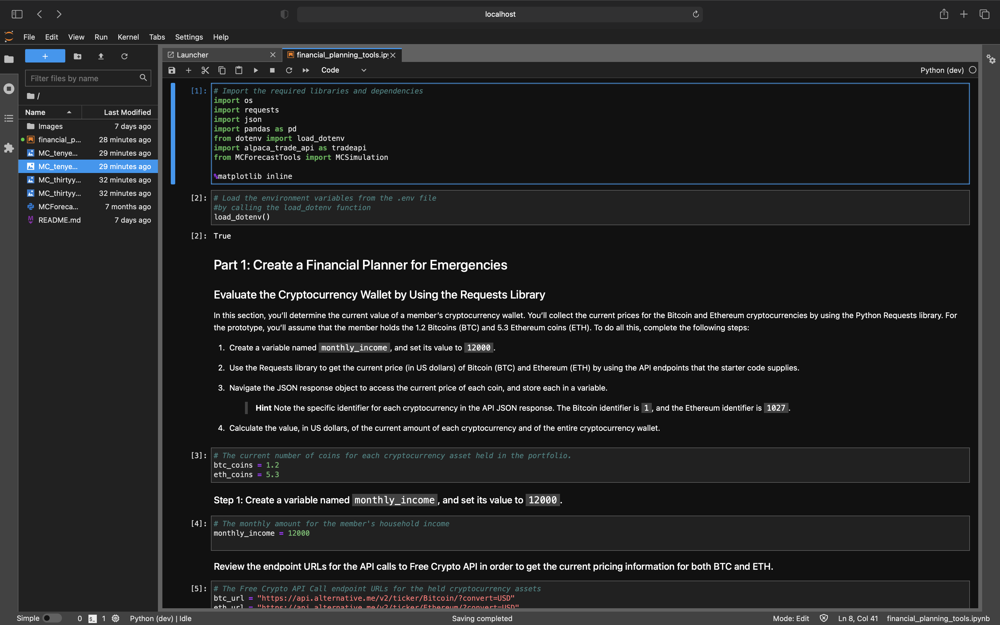
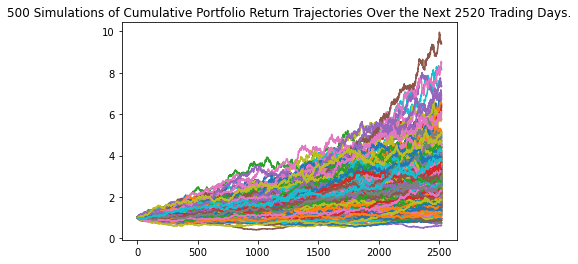
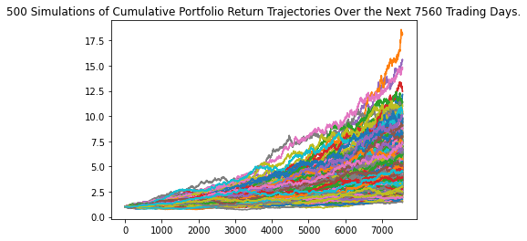

# Financial Planning tools with APIs and Monte Carlo Simulations

---

This is a Jupyter Lab via command line interface created code used with the assitance of Pandas to create an analysis of DataSets that were populated using APIs to analyze the returns of SPY and AGG over the past to determine their investent returns over the next 10-30 years. I used different weighting scenarios depeding on the credit-union clients level of risk to provide a forecast of potential investment returns using a simulation. These potential returns would then help the clients determine whether or not they could retire within 10 years depeding on how they invest their current savings.
---

## Technologies

This project uses python 3.7 with the following packages:

* [Pandas](https://github.com/pandas-dev/pandas) - Pandas is an open-source library that offers easy-to-use data analysis tools for Python.

* [Jupyter Lab](https://github.com/jupyterlab/jupyterlab-git) - For interactive analysis prompts and a code as you code structure

* [Monte Carlo Simulations](https://www.investopedia.com/terms/m/montecarlosimulation.asp) - For portfolio simulations and forecasting


 
---

## Installation Guide

Before running the application first install the following:


* [Install] Anaconda with Python 3.7+(https://docs.anaconda.com/anaconda/install/)
You should always be in a conda dev environment when launching JupyterLab.

```python
 conda install -c anaconda requests
 conda install -c jmcmurray json
 pip install python-dotenv
 pip install alpaca-trade-api

```
Create API keys with the following: 

* [Quandl](https://www.quandl.com)
* [Alpaca](https://app.alpaca.markets/signup)


---

## Import the following libraries and dependencies 

```python
import os
import requests
import json
import pandas as pd
from dotenv import load_dotenv
import alpaca_trade_api as tradeapi
from MCForecastTools import MCSimulation
```
---

## Usage

To view the financial_planning_tools.ipynb, open Terminal/ Use CLI

```conda activate dev
cd <location of (financial_planning_tools.ipynb)>
jupyter lab
```

Upon launching the Jupyter Lab application you will be greeted with the following prompts.




As Well as the following Visualizations.






---

## Contributors

Brought to you by MartyCodes333 (martique.henton@gmail.com) with the help of 2021 UW FinTech Bootcamp Instructors, TA's and Fellow Classmates


---